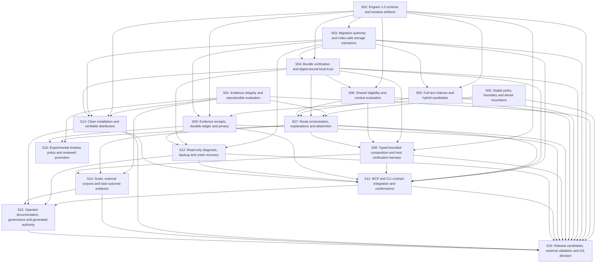

# Magicite V1 slice index

This is a specifications-only packet at baseline `496e4ed`. Start agents on one slice each; use build dependencies for independent module work and merge dependencies for production integration. No calendar deadline is imposed.

[Master spec](../magicite-v1.md) · [Shared contracts](contracts.md) · [Evaluation](evaluation.md) · [Release gates](release-gates.md) · [Scout](scout-report.md) · [Research corrections](research/corrections.md) · [Dispatch JSON](plan.json) · [Acceptance criteria](acceptance.md)

## Assignments

| Slice | Build after | Merge after | GA |
|---|---|---|---|
| [S00 — Stable policy boundary and dense incumbent](slices/s00-stable-policy-boundary-and-dense-incumbent.md) | Start now | None | Required |
| [S01 — Evidence integrity and reproducible evaluation](slices/s01-evidence-integrity-and-reproducible-evaluation.md) | Start now | None | Required |
| [S02 — Engram 1.0 schema and lossless artifacts](slices/s02-engram-1.0-schema-and-lossless-artifacts.md) | Start now | None | Required |
| [S03 — Migration authority and index-safe storage transitions](slices/s03-migration-authority-and-index-safe-storage-transitions.md) | S02 | S02 | Required |
| [S04 — Bundle verification and digest-bound local trust](slices/s04-bundle-verification-and-digest-bound-local-trust.md) | S02, S03 | S02, S03 | Required |
| [S05 — Full-text indexes and hybrid candidates](slices/s05-full-text-indexes-and-hybrid-candidates.md) | S02 | S02, S03 | Required |
| [S06 — Shared eligibility and context evaluation](slices/s06-shared-eligibility-and-context-evaluation.md) | S02 | S02, S04 | Required |
| [S07 — Route orchestration, explanations and abstention](slices/s07-route-orchestration-explanations-and-abstention.md) | S00, S01, S04, S05, S06 | S00, S01, S04, S05, S06 | Required |
| [S08 — Typed bounded composition and host verification harness](slices/s08-typed-bounded-composition-and-host-verification-harness.md) | S02, S06 | S02, S04, S06, S07 | Required |
| [S09 — Evidence receipts, durable ledger and privacy](slices/s09-evidence-receipts-durable-ledger-and-privacy.md) | S00, S02, S03 | S00, S02, S03 | Required |
| [S10 — Experimental shadow policy and reviewed promotion](slices/s10-experimental-shadow-policy-and-reviewed-promotion.md) | S01, S07, S09 | S01, S07, S09 | Optional |
| [S11 — MCP and CLI contract integration and conformance](slices/s11-mcp-and-cli-contract-integration-and-conformance.md) | S03, S04, S07, S08, S09, S12, S13 | S03, S04, S07, S08, S09, S12, S13 | Required |
| [S12 — Read-only diagnosis, backup and crash recovery](slices/s12-read-only-diagnosis-backup-and-crash-recovery.md) | S03, S04, S09 | S03, S04, S09 | Required |
| [S13 — Clean installation and verifiable distribution](slices/s13-clean-installation-and-verifiable-distribution.md) | Start now | S01, S02, S03, S04 | Required |
| [S14 — Scale, external corpora and task-outcome evidence](slices/s14-scale-external-corpora-and-task-outcome-evidence.md) | S01, S07, S08 | S01, S07, S08 | Required |
| [S15 — Operator documentation, governance and generated authority](slices/s15-operator-documentation-governance-and-generated-authority.md) | S11, S12, S13, S14 | S11, S12, S13, S14 | Required |
| [S16 — Release candidates, external validation and GA decision](slices/s16-release-candidates-external-validation-and-ga-decision.md) | S00, S01, S02, S03, S04, S05, S06, S07, S08, S09, S11, S12, S13, S14, S15 | S00, S01, S02, S03, S04, S05, S06, S07, S08, S09, S11, S12, S13, S14, S15 | Required |

## Dependency graph (merge gates)

## Practical parallel batches

- Start S00 policy isolation, S01 evidence harness, S02 schema and S13 installation/CI scaffolding together.
- After S02 contracts, build S03 migration, S05 candidate/index modules and S06 eligibility independently. S04 trust follows migration; their production wiring waits for the listed merge gates.
- S08 typed planner and S09 evidence ledger can advance against upstream fixtures; S07 integrates routing after trust/index/eligibility land.
- S12 recovery and S14 empirical evaluation proceed in separate lanes. S10 optional learning follows route/evidence results.
- S11 is the single CLI/MCP integrator after domain APIs and packaging scaffold are ready. S15 publishes generated/operator documentation, and S16 assembles release evidence.

These are readiness batches, not compulsory release versions or duration estimates. S13 owns later CI wiring changes requested by S11/S15 as small follow-up integration commits; scaffold completion is not published-channel verification. No slice may claim GA completion before its empirical/external gates pass.

## Agent pickup instructions

1. Check out the published specs branch or its spec commit; read the master, shared contracts, your slice and plan.json.
2. Create a separate implementation branch `codex/v1-sNN-<topic>` from the common base plus required merged dependencies. Do not share a writable checkout with another slice owner.
3. Record upstream SHAs and claim the slice in the team tracker. Build pure modules against contract fixtures while upstream production integration is pending.
4. Respect shared-file owners in C9. Offer call-site patches to the integrator instead of modifying their files concurrently.
5. Return every acceptance ID with its verifier/result, including failures and unevaluated empirical checks; include migration/rollback notes and contract fingerprints.
6. Amend specs explicitly if a contract proves wrong. Do not silently weaken safety, evaluation or release criteria to make tests green.

## Reading the status

All slices are proposed work. Planning gates verify structure, references, criteria and review; they do not demonstrate implementation or V1 readiness. External reproduction/pilot reports, publishing account setup and host matrix execution remain future release requirements.

S13 milestone `scaffold` unblocks S11; `published-channels` runs after S11/S15 and unblocks S16. S11 does not wait for final publication evidence to implement bindings. S07 owns mandatory policy activation/rollback; optional S10 consumes it.
