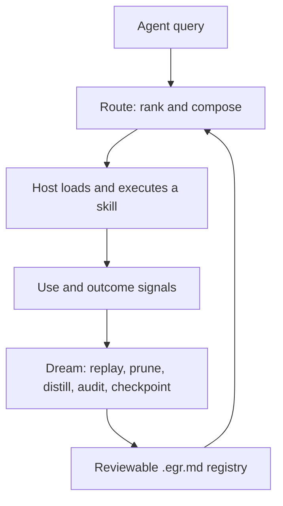

<div align="center">

# Magicite

### Skills that learn—without leaving your repository.

Magicite is a local-first MCP server that routes an agent to the right skill,
captures what happened, and turns that evidence into reviewable improvements.

[](https://github.com/Rynaro/magicite/actions/workflows/ci.yml)
[](CHANGELOG.md)
[](pyproject.toml)
[](https://modelcontextprotocol.io/)
[](LICENSE)
[](https://github.com/Rynaro/magicite/stargazers)

[Quick start](#quick-start) · [How it works](#how-it-works) ·
[Engrams](#the-engram-format) · [Evidence](#evidence-without-hand-waving) ·
[Documentation](#documentation)

</div>

---

Most agent skill registries are static catalogs: they can describe what a
skill does, but they do not learn which skills work together, where they fail,
or when they should stay out of the way.

Magicite adds that missing lifecycle. Skills live as portable `.egr.md`
**engrams**. A local routing engine ranks them from intent, positive and
negative cues, declared relationships, and observed outcomes. A resumable
**Dream** cycle consolidates useful evidence back into reviewable files.

The boundary is intentional: **Magicite stores, routes, and audits skills. It
never executes them.** Your agent host remains responsible for permissions,
sandboxing, and execution.

## Why Magicite?

| | What Magicite provides |
|---|---|
| **Local by default** | stdio MCP, project-local SQLite/WAL, offline embeddings after one explicit model fetch, and no hosted control plane. |
| **Portable by design** | Human-readable `.egr.md` files are the source of truth. The database is a disposable index that can be rebuilt from them. |
| **Adaptive, not opaque** | Usage and outcome signals influence routing through explicit, inspectable plasticity state instead of an invisible recommendation service. |
| **Graph-aware** | Skills can declare dependencies, composition, and inhibition; routing can return an ordered multi-skill plan rather than only one winner. |
| **Governed** | Every tool has a risk and side-effect class. Durable lifecycle changes are approval-gated by default and leave an audit trail. |
| **Host-agnostic** | Any MCP client can use the core server. Hooks improve signal quality, but they are an adapter—not a dependency. |

## Quick start

### 1. Install from source

Magicite requires Python 3.11+ and [`uv`](https://docs.astral.sh/uv/).

```bash
git clone https://github.com/Rynaro/magicite.git
cd magicite

uv sync --all-extras
uv run magicite fetch-model
uv run magicite sync --project-root .
uv run magicite doctor --project-root .
```

`fetch-model` is the one intentional network-bearing runtime setup step. Once
the ONNX model is present, Magicite can run with network access disabled. The
repository includes 30 first-party engrams, so the commands above produce a
working dogfood registry immediately. `doctor` will still warn that 30 skills
sit below a historical ~50-skill research reference; that warning is expected
and deliberately does not present the heuristic as a proven break-even point.

### 2. Connect your MCP client

Point the client at the installed executable and the project whose
`.magicite/` directory should own the registry:

```json
{
  "mcpServers": {
    "magicite": {
      "command": "/absolute/path/to/magicite/.venv/bin/magicite",
      "args": [
        "serve",
        "--project-root",
        "/absolute/path/to/your-project"
      ],
      "env": {
        "MAGICITE_EMBEDDING_OFFLINE": "1"
      }
    }
  }
}
```

For Claude Code, continue with the
[host adapter guide](docs/adapters/claude-code.md). Tier-2 hooks are optional;
ordinary MCP clients retain Tier-1 self-report and Tier-0 passive signals.

### 3. Route, load, and report

A normal agent loop uses only a small part of the 16-tool surface:

```text
route({ query, session_id })
  -> ranked candidates + bounded composition plan

load_skill_body({ name, level: "L2" })
  -> procedure + pitfalls

signal_use({ skill_ids, session_id })
signal_outcome({ valence, salience, skill_ids, session_id })
  -> evidence for later consolidation
```

The `route` response includes the instructions needed to close this loop. Skill
bodies are loaded only after selection, keeping context use progressive rather
than injecting the whole registry into every prompt.

### Container deployment

Release images are built for `linux/amd64` and `linux/arm64`. They run as a
non-root user, bake the FastEmbed model during the build, and complete their MCP
handshake without network access. Pin the image by the digest published on the
matching [GitHub Release](https://github.com/Rynaro/magicite/releases):

```bash
MAGICITE_IMAGE='ghcr.io/rynaro/magicite@sha256:<release-digest>'

docker run --rm -i \
  --user "$(id -u):$(id -g)" \
  --cap-drop ALL \
  --security-opt no-new-privileges \
  -v "$PWD":"$PWD":z \
  -w "$PWD" \
  "$MAGICITE_IMAGE" \
  serve --project-root "$PWD"
```

The `--user` mapping is required for bind-mounted projects: Magicite creates
and updates project-local state, so the container must write with the host
owner's UID and GID. See the [operations runbook](docs/operations.md) for the
complete deployment and filesystem guidance.

## How it works



Magicite separates the system into three paths:

- **Hot path:** embed the query, select candidates, spread bounded activation,
  apply contraindication and inhibition penalties, and return compact metadata.
- **Signal path:** record session-scoped use and outcome evidence without
  writing learned state into skill files.
- **Dream path:** consolidate durable node and edge state through resumable,
  lease-fenced phases, then checkpoint deterministic changes to disk.

The storage model keeps authority legible:

```text
.magicite/
├── engrams/              # portable source of truth
│   ├── *.egr.md
│   └── skill-graph.db    # local, rebuildable index; ignored by default
├── archive/              # lifecycle archive; never silent deletion
├── approvals/            # durable approval mirrors
└── runtime/              # local coordination and adapter state
```

Multiple readers and session writers share SQLite WAL. All durable writers use
one cross-process lease with fencing tokens, so a stale process cannot publish
after losing ownership. Dream and idempotent MCP writes can recover after
process death without replaying already-committed work.

Read the full [architecture](docs/02-architecture.md) and
[learning model](docs/03-learning-model.md).

## The engram format

An engram combines routing intent, contraindications, composition contracts,
plasticity, trust, and an append-only provenance journal in one Git-friendly
Markdown artifact.

```yaml
---
spec: engram/0.2
name: magicite-honest-claim-scope
id: egr_3579bb59
version: 1
provenance: authored

intent:
  does: "State what Magicite's evidence does and does not license"
  use_when: "reviewing a claim about routing, graph, or learning capability"
  not_when: "producing the measurement itself"

triggers:
  positive:
    - "review a magicite claim for overstatement"
  negative:
    - "run the retrieval benchmark"

needs: [magicite-run-retrieval-benchmark]
yields: [calibrated-claim]
composes: []
inhibits: []

trust:
  origin: authored
  verification_status: pending
---

## Procedure
1. Start from the falsification record, not the feature list.
2. State what the measurement supports and what it does not.
```

This example is trimmed from Magicite's own registry. In the complete format:

- `intent` and positive triggers form the versioned positive routing view;
- `not_when` and negative triggers form a separate contraindication view;
- `needs` and `composes` participate in bounded plan expansion;
- `yields` is portable metadata in 0.3, not yet a graph edge;
- lifecycle, verification, and operation-execution status remain independent;
- learned state and every mutation remain inspectable and attributable.

See the [engram specification](docs/04-engram-format.md) and the bundled
[JSON Schema](src/magicite/engram/schema/engram-0.2.schema.json).

## The 16-tool surface

The public MCP API is intentionally small and generated from the same registry
used by the server and tests.

| Area | Tools | Side effects |
|---|---|---|
| Retrieve and inspect | `route`, `load_skill_body`, `introspect`, `flag_dead` | R0 / none |
| Capture signals | `signal_use`, `signal_outcome`, `session_end` | R1 / ephemeral |
| Manage the registry | `register`, `sync`, `checkpoint`, `export` | R2 / project-local |
| Govern lifecycle | `nucleate`, `sharpen`, `promote`, `archive` | R3 / approval-gated |
| Consolidate | `consolidate` | R3 / resumable batch |

Inspect the authoritative schemas directly:

```bash
uv run magicite tools
```

Unknown fields are rejected. Writes support request-level idempotency, and the
server exposes no R4/R5 network, shell, raw SQL, or arbitrary filesystem tool.

## Trust and integrity

Magicite treats adaptive behavior as a governance problem, not just a ranking
problem.

- **No skill execution:** code blocks remain inert text; the host owns execution
  and its permission boundary.
- **Offline source use:** FastEmbed is the production provider, but runtime
  lookup is offline by default after explicit acquisition.
- **Untrusted input handling:** imported engrams are scanned and can be held in
  pending or quarantined verification states.
- **Approval-gated change:** R3 operations propose durable lifecycle mutations
  for review unless autonomous mode is explicitly enabled.
- **Recoverable writes:** atomic publication, fencing tokens, phase cursors, and
  deterministic checkpoints protect file and database integrity.
- **Secret hygiene:** adapter tokens are recursively redacted before canonical
  event and idempotency hashing.
- **Supply chain:** release workflows use immutable action references, scan the
  image, and produce signatures, SBOMs, and provenance attestations.

For the exact model, read [trust, governance, and lifecycle](docs/06-trust-governance-lifecycle.md)
and the [operations runbook](docs/operations.md).

## Evidence, without hand-waving

Magicite separates **implemented capability** from **validated hypothesis**.
That distinction is part of the product.

| Claim | Current evidence |
|---|---|
| Portable registry, rebuildable index, governed lifecycle, and recoverable Dream execution | Mechanically verified by unit, integration, acceptance, and spawned-process crash tests. |
| Offline stdio server and hardened container handshake | Verified in CI with networking disabled for the runtime path. |
| Full Magicite routing beats plain dense embeddings | **Not demonstrated.** On the 70-skill / 210-query study, dense Hit@1 was `0.5476`; the full pipeline was `0.5333`—a difference of 3 queries and statistically indistinguishable. |
| Graph activation and learned state improve routing | **Not demonstrated.** The central declared-edge hypothesis still needs an independent, purpose-built evaluation. |
| A roughly 50-skill break-even point exists | **Not demonstrated.** It remains a historical reference size, not a product claim. |
| Sub-100 ms routing at 10k skills | **Not claimed.** The 10k matrix is measurement evidence and a profiling target, not a passing latency promise. |

The current study is bounded: one author, one annotator, one embedder, and a
uniform learning workload. Mechanism repairs between releases are not presented
as validation of the underlying hypothesis.

Read the [falsification record](docs/01-vision-and-hypotheses.md) and
[evaluation methodology](docs/07-evaluation-and-observability.md), or validate
the versioned composition corpus and superseding result artifact:

```bash
uv run python -m magicite.eval validate-corpus docs/evaluation/composition-v0.3.json
uv run python scripts/check_evaluation_results.py docs/evaluation/v0.3-results.json
```

For a registry with independently labelled queries, `magicite-bench` runs the
four comparable lexical, embedding, structural, and production baselines; see
the [benchmark harness guide](docs/operations.md#11-the-magicite-bench-harness-standing-kpis-and-ablations-m6).

## Dogfooding

Magicite routes maintenance of its own repository through 30 first-party
engrams connected by declared dependency and inhibition edges. A real stdio MCP
driver exercises all 16 tools; graph guards check dangling targets and stale
code references.

```bash
uv run python scripts/dogfood_graph_check.py --edges
uv run python scripts/dogfood_graph_check.py --symbols
uv run python scripts/dogfood_session.py --out /tmp/magicite-session.json
```

This proves end-to-end wiring, not retrieval quality. The
[dogfooding report](docs/adapters/dogfooding.md) records both what worked and
what the exercise exposed.

## Configuration

Configuration resolves from defaults, then `.magicite/magicite.toml`, then
`MAGICITE_*` environment variables.

| Variable | Purpose |
|---|---|
| `MAGICITE_EMBEDDING_PROVIDER` | `fastembed` (default), `hashing` for deterministic tests, or optional `ollama`. |
| `MAGICITE_EMBEDDING_OFFLINE` | Refuse runtime model downloads when set to `1`. |
| `MAGICITE_HOOK_TOKEN` | Enable trusted Tier-2 host-adapter signals. Never place it in an engram. |
| `MAGICITE_AUTONOMOUS` | Opt into autonomous R3 execution for a trusted registry. Review mode is the default. |

All routing, plasticity, consolidation, retention, and plan bounds are
documented in the [operations configuration reference](docs/operations.md#10-quick-reference--environment-variables).

## Documentation

| Read this | For |
|---|---|
| [Authority manifest](docs/AUTHORITY.md) | What defines current 0.3 behavior when historical records disagree. |
| [Documentation index](docs/README.md) | The complete reading order and terminology. |
| [Vision and hypotheses](docs/01-vision-and-hypotheses.md) | Problem statement, falsification record, and research agenda. |
| [Architecture](docs/02-architecture.md) | Hot/write/Dream paths, storage, concurrency, and security boundary. |
| [Learning model](docs/03-learning-model.md) | Plasticity, signals, decay, and consolidation semantics. |
| [Engram format](docs/04-engram-format.md) | Portable artifact schema and lifecycle. |
| [Protocol and signals](docs/05-protocol-and-signals.md) | Tool contracts and Tier-0/1/2 signal ladder. |
| [Trust and governance](docs/06-trust-governance-lifecycle.md) | Risk classes, approvals, provenance, and recovery. |
| [Evaluation](docs/07-evaluation-and-observability.md) | Baselines, metrics, experiments, and observability. |
| [Operations](docs/operations.md) | Deployment, diagnostics, concurrency, recovery, and release channels. |

## Development

```bash
uv sync --all-extras

uv run ruff check .
uv run mypy src
uv run pytest -q -m "not benchmark"
uv run pytest -q -m acceptance
uv run magicite tools | jq '.tools | length'  # 16
```

The hardened-image gate additionally builds the production container, performs
the offline MCP smoke test, runs the production benchmark matrix, and fails on
HIGH/CRITICAL vulnerabilities.

To work on Magicite effectively, start with [AGENTS.md](AGENTS.md) and
[EIDOLONS.md](EIDOLONS.md). The repository uses its own engrams to route
maintenance decisions, and the CI contract expects documentation claims to
remain synchronized with the runtime.

## Project status

Magicite 0.3.0 is an experimental but fully test-governed local skill router.
The portable format, MCP surface, integrity model, lifecycle governance, and
Dream recovery are implemented. The research question—whether graph and
plasticity layers improve routing over simpler retrieval—remains open by
design, measured rather than assumed.

See [CHANGELOG.md](CHANGELOG.md) for release history and
[GitHub Releases](https://github.com/Rynaro/magicite/releases) for signed
artifacts and immutable container digests.

## License

Magicite is available under the [Apache License 2.0](LICENSE).
